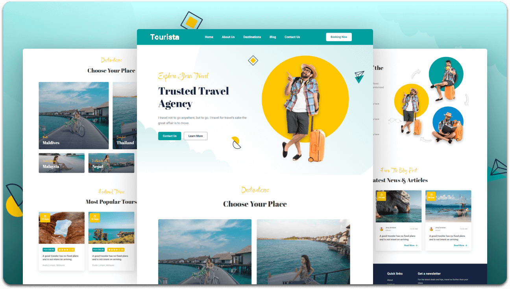

<div align="center">
    <h2 align="center">Tourista - A trusted travel agency website</h2>
    <a href="" ><strong>➥ Live Demo</strong></a>

</div>

<br />

### Demo Screeshots



### Prerequisites

Before you begin, ensure you have met the following requirements:

* [Git](https://git-scm.com/downloads "Download Git") must be installed on your operating system.

### Run Locally

To run **Tourista** locally, run this command on your git bash:

Linux and macOS:

```bash
sudo git clone https://github.com/srsngawt/tourista.git
```

Windows:

```bash
git clone https://github.com/srsngawt/tourista.git
```

### Contact

If you want to contact with me you can reach me at [Linkedin](https://www.linkedin.com/in/shubham-sangawat-ba4b661b1/).

### License

This project is **free to use** and does not contains any license.